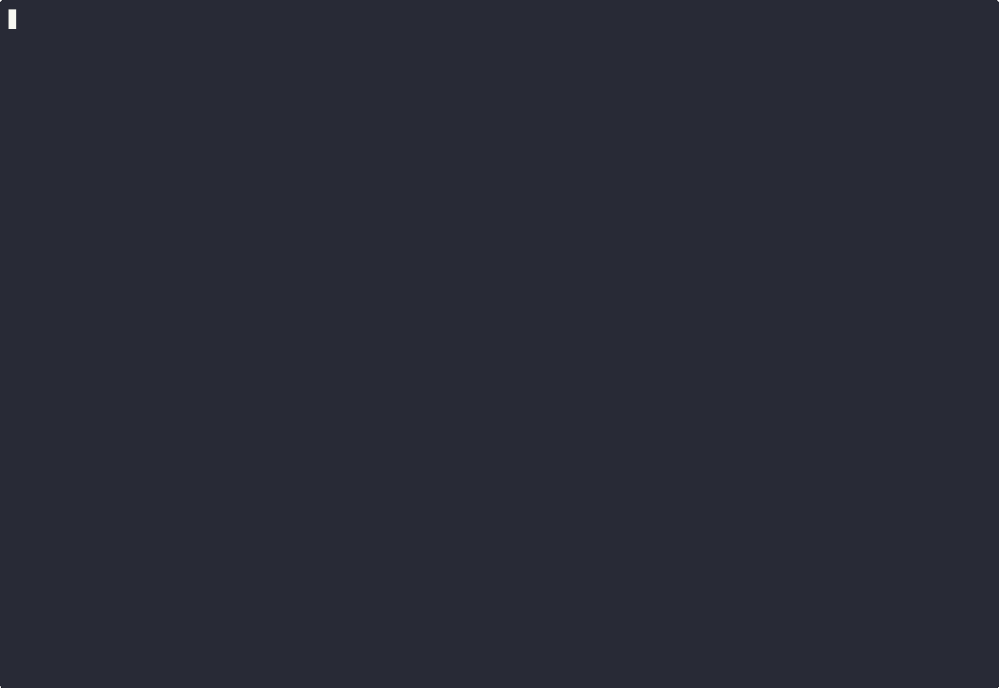
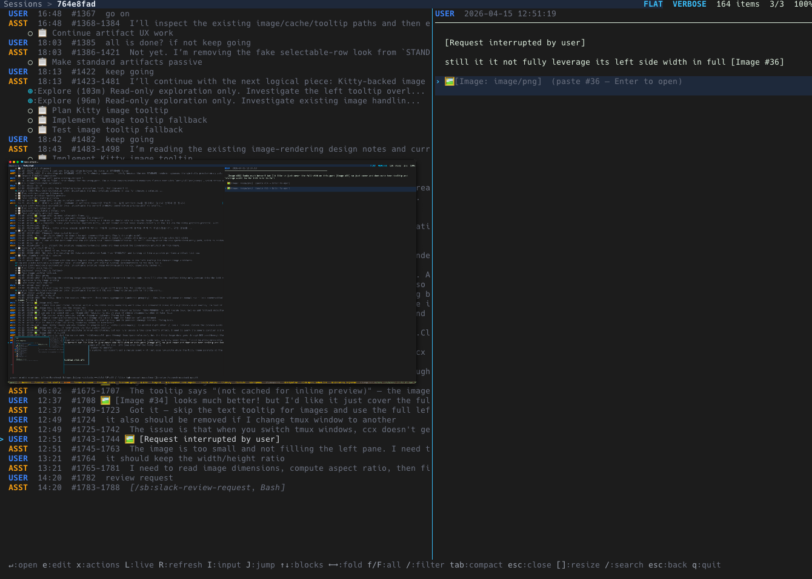

# ccx — Claude Code Explorer

A terminal UI for browsing, inspecting, and managing [Claude Code](https://docs.anthropic.com/en/docs/claude-code) sessions.

Browse sessions, read conversations, inspect tool calls, view agent hierarchies, explore configs/plugins, and get aggregated stats — all from your terminal.



> More demos: [conversation](docs/DEMOS.md#conversation), [command mode](docs/DEMOS.md#command-mode), [views](docs/DEMOS.md#views), [URL/file actions](docs/DEMOS.md#actions), [sandbox testing](docs/DEMOS.md#sandbox)

## Install

```bash
go install github.com/sendbird/ccx@latest
```

Or build from source:

```bash
git clone https://github.com/sendbird/ccx.git
cd ccx
make build      # -> bin/ccx
make install    # -> ~/.local/bin/ccx
```

## Usage

```bash
ccx                        # launch TUI
ccx -view config           # start in config explorer
ccx -view stats            # start in global stats
ccx -view plugins          # start in plugin explorer
ccx -group tree            # start with tree grouping
ccx -group daily           # start in the daily activity view
ccx -preview stats         # start with stats preview open
ccx -search "is:live"      # start filtered to live sessions
```

### `ccx sessions -pick`

Interactive session resolver for shells, scripts, and agents. Launches the full `ccx` TUI on **stderr**; stdout is reserved for JSON.

To confirm a pick, press `P`. Navigate with arrows, multi-select with `space`, filter with `/`.

```bash
# basic usage
sid=$(ccx sessions -pick | jq -r '.sessions[0].id')
claude --resume "$sid"

# narrow with filter query (same syntax as TUI /)
ccx sessions -pick -search "is:current is:live"

# multi-select
ccx sessions -pick -multi | jq '.sessions | length'
```

**Flags:**

| Flag | Description |
|------|-------------|
| `-search STR` | Initial filter query (same syntax as TUI `/` search) |
| `-multi` | Allow multi-selection (space to toggle, `P` to confirm) |
| `-dir PATH` | Claude data directory (default: `~/.claude`) |

**Output schema (stable):**

```json
{
  "sessions": [
    {
      "id": "a1b2c3…",
      "project_root_path": "/Users/edgar/code/...",
      "transcript_path": "/Users/edgar/.claude/projects/-Users-.../a1b2c3….jsonl"
    }
  ]
}
```

`sessions` is always an array; single-select yields length 1.

**Exit codes:**

| Code | Condition |
|------|-----------|
| 0    | User confirmed; JSON printed to stdout |
| 1    | Internal error (stderr message) |
| 2    | No candidates after filtering |
| 130  | User cancelled (Esc / Ctrl-C) |


### CLI Flags

| Flag | Description |
|------|-------------|
| `-version`, `-v` | Print version and exit |
| `-dir PATH` | Claude data directory (default: `~/.claude`) |
| `-view MODE` | Initial view: `sessions`, `config`, `plugins`, `stats` |
| `-group MODE` | Initial grouping: `flat`, `proj`, `tree`, `chain`, `fork`, `repo`, `projects`, `daily` |
| `-preview MODE` | Initial preview: `conv`, `stats`, `mem`, `scratch`, `tasks`, `refs`, `outputs` |
| `-search QUERY` | Start with session filter applied |
| `-tmux` | Enable tmux integration (auto-detected) |
| `-tmux-auto-live` | Auto-enter live session in same tmux window |
| `-worktree-dir NAME` | Worktree subdirectory name (default: `.worktree`) |

The Claude data directory is resolved in order: `--dir` flag → `CLAUDE_CONFIG_DIR` env → `~/.claude`.

## Views

### Session Browser

Browse all Claude Code sessions across projects, sorted by recency.

- **Status badges** — at-a-glance session state (see [Session Badges](#session-badges))
- **Search** (`/`) — filter by project, branch, prompt, window name, or tags
- **Group modes** (`G` or `:group:*`):
  - **Flat** — simple list sorted by time
  - **Project** — clustered by project path
  - **Tree** — team hierarchy with leader/teammate nesting
  - **Chain** — resume-chain grouping (parent → child)
  - **Fork** — agent-fork grouping
  - **Daily** (`D`) — day → project → session tree (newest day first), previewing what each level produced
- **Directory filter** (`g`) — scope to a single project directory
- **Preview pane** (`Tab` to cycle): conversation, stats, memory, tasks/plan, workflows, outputs, references, live
- **Fleet notifications** — when a live session transitions into an attention state (→ `WAIT`/`DONE`/`STUCK`), a `(!)N` indicator appears in the status bar; press `n` to jump to the most recently notified session
- **Multi-select** (`Space`) — bulk delete, copy paths, send input
- **Actions menu** (`x`) — delete, move, resume, copy path, worktree, kill, input, jump, URLs, files
- **Command mode** (`:`) — vim-style commands with fuzzy suggestions

#### Search Filters

| Filter | Matches |
|--------|---------|
| `is:live` | Running Claude process |
| `is:busy` | Actively responding |
| `is:wt` | In a git worktree |
| `is:team` | Part of a team session |
| `is:fork` | Forked from another session |
| `has:mem` | Has memory file |
| `has:todo` | Has todos |
| `has:task` | Has tasks |
| `has:plan` | Has plan |
| `has:agent` | Has subagents |
| `has:compact` | Uses message compaction |
| `has:skill` | Used skills |
| `has:mcp` | Used MCP tools |
| `is:mon` | Has a Monitor job in flight |
| `is:input` | Live, awaiting your answer (AskUserQuestion) |
| `team:NAME` | Filter by team name |
| `win:NAME` | Filter by tmux window name |
| `is:current` | Session's project path matches invoker cwd or tmux-window Claude process |

Plain text terms match against project path, name, branch, session ID, first prompt, and teammate name. Multiple terms are AND-matched.

#### Session Badges

Each session row carries two kinds of badges. Independent badges can co-occur; lifecycle badges are mutually exclusive (highest-priority one wins).

**Independent:**

- `[HERE]` — session belongs to the current tmux window
- `[LIVE]` — a Claude process is attached to the session
- `[MON×N]` — N Monitor jobs currently in flight (live sessions)
- `[INPUT]` — live session blocked on an unanswered AskUserQuestion
- `[R·exp]` — remote session (experimental)
- Custom tags — user-applied via `x` → `t` (see [docs/CUSTOM_BADGES.md](docs/CUSTOM_BADGES.md))

**Lifecycle** (priority high → low; at most one shown):

| Badge | When |
|-------|------|
| `[BUSY]` | Claude is actively responding (JSONL written within ~10s) |
| `[BG]` | Live session has a shell/Monitor job, or any cron is `active` |
| `[STUCK]` | Live, JSONL stale for >30min, and unfinished todos/tasks exist |
| `[WAIT]` | Live, idle, with unfinished todos/tasks |
| `[DONE]` | Session had todos/tasks and all are completed |

Example: `[HERE][LIVE][WAIT] my-feature` — current window, live process, idle with pending work.

### Cross-Session Search

Search inside conversation content across all sessions (`Ctrl+S` or `:search`).

**Search syntax:**
- `word1 word2` — AND match (all terms must appear)
- `"exact phrase"` — Exact phrase matching
- `-exclude` — Exclude terms from results
- `user:` — Only search user messages
- `assistant:` — Only search assistant responses
- `tool:ToolName` — Only search specific tool calls

**Features:**
- Searches text, tool inputs, thinking blocks, and system tags
- Results are ordered newest session first
- Matched terms are highlighted in snippets
- `[LIVE]` / `[HERE]` badges show which hits belong to a running session, updated
  while the results are open
- Press `Enter` to jump to the matching message
- Press `r` to go straight back to work in that session: attach to its tmux pane
  if it is live, otherwise resume the transcript in a tmux window
- Press `/` to edit the query

**Index:**

Search is backed by a SQLite FTS5 index at `~/.claude/.ccx-index.db` (~400 MB for
a 2.5 GB transcript corpus), which makes a typical query take tens of
milliseconds instead of seconds.

- The index refreshes when you search: only transcripts whose size or mtime
  changed are re-read, so results are always current. The first build takes
  about a minute; after that a refresh is milliseconds.
- **Tool output (`tool_result`) is not indexed.** It is half the corpus and
  mostly file dumps, so including it would roughly double the index for little
  search value. The modal says `tool output not indexed` when this applies.
- Queries with a term shorter than 3 characters fall back to a full scan
  automatically — a trigram index cannot match them.
- The index is a cache: deleting it is safe, and a corrupt one is rebuilt.

**Example queries:**
```
database migration                    # Find both terms
"how do I" API                        # Phrase + term
user: error -test                     # User messages with "error", excluding "test"
assistant: "I recommend" -deprecated  # Complex combination
```

### Unified Session Flow

Drill into any session to see one chronological spine containing conversation turns, subagents, workflow runs and phases, shell/monitor jobs, tasks, and decision markers. Lifecycle rows are inserted at their exact originating turn rather than collected in a separate hierarchy.

- **Flow ↔ inspector focus** (`Tab`) — move between the chronological spine and the selected node's inspector
- **Inspector facets** (`[`/`]`) — cycle the selected node's non-empty Overview, Conversation, Changes, Files, Refs, Images, and Stats facets
- **Scope** (`s`) — aggregate the inspector over Node → Subtree → Session without silently falling back to a wider scope
- **Session facet picker** (`p`) — jump directly to session-wide URLs, images, changes/files, or contexts
- **Zoom** (`z`, or `Enter` on a conversation turn) — render the same inspector full-width; `Esc` returns without changing selection or fold state
- **Three conversation detail levels** — Compact (text), Standard (text + artifacts), and Verbose (tools, results, hooks); use `detail:text|tool|hook` in command mode
- **Block navigation and folding** (`↑`/`↓`, `←`/`→`, `f`/`F`) — navigate and disclose content in both split and zoomed inspectors
- **Block filter** (`/`) — filter by `is:tool`, `is:hook`, `is:error`, `is:skill`, `is:mcp`, `tool:Name`, or `tool:Prefix*`
- **Copy mode** (`v`) — line selection works in the same inspector, including zoomed structured/verbose content
- **Exact provenance jump** (`J`) — lifecycle and artifact rows jump to their owning conversation turn
- **Recursive subagent drill-down** (`Enter` on agent) — opens the agent transcript with a back-stack while preserving inspector state
- **Kitty image preview** — inline, aspect-ratio-preserving rendering for Kitty-compatible terminals (kitty, WezTerm, ghostty), including images owned by subagent transcripts
- **Live controls** — `L` toggles live tail, `I` sends input, and `J` switches to the tmux pane when a conversation turn is selected



#### Daily Activity View (`D`, or `:group:daily`)

A date-first view for reviewing what got done rather than which project it happened in. Press `D` to flip into it from any grouping and `D` again to return — it is an axis you toggle while reading, not a mode you commit to. `D` works whether the list or the preview has focus, keeps the cursor on the same session across the swap, and remembers the grouping it returns to across restarts (so starting in the daily view still takes you back to *your* view, not the default). Each view keeps its own preview mode — the daily view opens on outputs, the project browser on the conversation — so a swap never lands you on the wrong pane.

The list nests three tiers — **day → project → session** — each folding with `Enter`/`o` and aggregating exactly what its level needs: a date row rolls up the whole day, a project row rolls up that day's work in one repo, and sessions sit underneath. A busy day really can hold 250+ sessions across 30 projects, and the project tier is what keeps that readable.

The preview always shows **what that scope produced** — PRs, Jira issues, artifacts and plans, one row each. Selecting a date row shows the day's outputs; selecting a project row narrows to that project on that day. The sessions themselves are not listed in the pane: they are one row below in the list.

Rows read as a **timeline**: every output in the order it first appeared, stamped with that time, kinds interleaved — a day is lived in time, and "what happened after the PR went up" is the question the pane is usually asked. An output whose first mention falls on another date (a long-lived session carrying a ref in) shows its full date rather than a bare time that would belong to the wrong day, and a `~` marks a time taken from the producing session because the output records no entry of its own (plan slugs, and refs extracted by an older build).

To read one kind at a time, the pane is **tabbed**: `All` plus a tab for each kind the scope produced (`PRs`, `Jira`, `Artifacts`, `Plans`), each carrying its own count so the bar doubles as the day's rollup. `tab`/`shift+tab` walks the bar, and the number keys jump straight to a tab — `1` is `All` and the rest follow the bar **as rendered**, so `4` is whatever sits fourth on screen (the bar drops kinds the day produced none of, so a fixed digit-to-kind table would point at labels that are not there). The digits are the same keys that select preview modes on a session row; a day row has no preview modes, so they address the only axis it has. Kinds are tabs rather than sections in one list because a busy day produces 500+ outputs, and stacked sections put the later kinds hundreds of lines below the fold. Every tab keeps the one chronology, and the selected tab is sticky as you walk between dates, so "what PRs did each day produce" stays a single keypress per day; a day with none of that kind says so rather than silently falling back to `All`.

Every output row carries the session that produced it as an anchor (`a1b2c3 · ~/src/repo`). Focus the preview and press `Enter` on a row to land in that conversation **at the message where the output first appeared** — the digest tells you *what* came out, and the anchor is how you get to *how*. `o` opens the output itself (a PR, Jira issue or artifact in the browser), `y` copies its URL or path, and `x` lists every action that applies to the row (see [Output Row Actions](#output-row-actions-x)). Outputs referenced from several sessions collapse to one row with a `+N` spread marker, anchored to the earliest session (where the work happened, not where it was later quoted) — and the jump lands in *that* session, at *its* first mention.

The pane also has **its own search**: with the preview focused, `/` filters the day's outputs by text (title, detail, path, URL, kind, project), AND-ing terms so `cplat argocd` narrows without you having to know which field holds which part. It composes with the kind tab, and the heading says the count is filtered (`Produced (3) of 682  /cplat`) so a narrowed list is never mistaken for a quiet day. This is deliberately **separate from the session list's `/`** — the two panes answer different questions ("which sessions" vs "which outputs"), and a day with hundreds of outputs needs narrowing even when the session list does not. `Esc` clears it; unlike the kind tab, the query does not travel across dates.

Sessions are bucketed by the calendar day of their **last** activity. A session that spans midnight appears once, under the day it was last active — it is never duplicated across dates.

**Known limitation — produced vs. referenced.** A reference counts as an output if the session's transcript contains its URL, which includes links that were merely read or quoted (a `kubernetes/kubernetes` PR consulted during debugging shows up next to the PR the session actually opened). Artifacts already avoid this — they are only counted from the `Published … at <url>` tool result — but PRs and Jira issues have no equivalent creation marker yet. Treat the Produced list as "references this day touched", weighted toward what it created.

#### Outputs Digest (`p` → `o`, or `:preview:outputs`)

The per-session counterpart of the daily view: what this session produced, not what it said. Rows are grouped as results first, then working material:

| Section | Source |
|---------|--------|
| Pull Requests / Jira Issues / Artifacts | Links found in the transcript, with live status (shares the References pipeline and its cache) |
| Plans | `ExitPlanMode` writes plus the plan files recorded on the session |
| Memory | Writes under a `memory/` directory or `MEMORY.md`, titled with the note's frontmatter description |
| Files Changed | `Edit`/`Write`/`MultiEdit`/`NotebookEdit` targets, collapsed per path with a write count (`Read` does not count) |
| Scratchpad | Files in the session's scratchpad directory |

With the preview focused, `↑↓` moves the cursor, `y` copies the row's URL or path, and `Enter` opens it: external references go to the browser, and everything else jumps into the conversation at the entry that produced it. `x` opens the row's full action menu — see below.

#### Output Row Actions (`x`)

Both output panes — the daily view's **Produced** list and the per-session **Outputs** digest — put every action for the row under the cursor behind `x`, the same modal-hint pattern the session browser uses. The menu lists **only what the row can actually do**, because a PR has no file to edit and a scratchpad file has no URL to open:

| Key | Action | Offered when |
|-----|--------|--------------|
| `o` | Open in browser | The row has a URL (PR, Jira issue, artifact) |
| `↵` | Jump to first mention | The row records the transcript entry it came from |
| `↵` | Open the conversation | No entry was recorded (e.g. a plan slug inherited from a parent session), but the producing session is known |
| `e` | Open in `$EDITOR` | The row is a local file (Files Changed, Scratchpad, plan files, memory notes) |
| `y` | Copy | Always — the URL when there is one, the path otherwise |

The hint box names the row it acts on (its section and title) so you can see what you are about to do it to. `Enter`, `o` and `y` keep working directly without the menu — `x` is the discoverable surface, not a replacement for the fast path. Letters follow your `actions` keymap (`edit`, `copy_path`), so rebinding those rebinds these.

#### Switching the Preview (`p`)

`p` opens the preview-mode menu — `v`:conv `s`:stats `m`:mem `x`:scratch `t`:tasks `a`:agents `w`:workflows `c`:contexts `r`:refs `o`:outputs `l`:live — from **either side**, whether the cursor is in the list or the preview has focus. It is the letter-based counterpart to the number keys (`0`-`9`), and follows the same rule about honesty: on a date row or a day-scoped project row the menu does not open, because those rows always render that scope's outputs and cannot honor any preview mode. The number keys already refuse there for the same reason.

#### Subagent and Workflow Support

Subagents and workflow agents are displayed inline at their exact spawn origin:

| Type | Badge | Source |
|------|-------|--------|
| `aside_question` | `?` `:btw` | Side-question (background Q&A) |
| `Explore` | `⊕ Explore` | Codebase exploration agent |
| `general-purpose` | `⊕ general-purpose` | Default agent |
| Workflow agent | workflow/phase lifecycle row | `subagents/workflows/{runId}/agent-*.jsonl` |
| Custom types | `⊕ {type}` | From `agent-*.meta.json` |

Agent type detection reads `agent-{id}.meta.json` (preferred) or parses the type from `agent-{type}-{hash}.jsonl`. Auto-compaction files (`agent-acompact-*.jsonl`) are excluded. Workflow summaries are joined from `{sessionID}/workflows/{runId}.json`, and nested workflow agents retain their run/phase ownership.

### Global Stats (`v` → `s`)

Aggregated metrics across all sessions with detail drill-down.

- **Overview** — total sessions, messages, tokens, duration, cost
- **Tools** (`p` → `t`) — built-in tool usage with timeline sparklines
- **MCP Tools** (`p` → `m`) — MCP tool usage with error tracking
- **Agents** (`p` → `a`) — agent type breakdown (Explore, general-purpose, etc.)
- **Skills** (`p` → `s`) — skill usage with per-skill error counts
- **Commands** (`p` → `c`) — command usage with per-command error counts
- **Errors** (`p` → `e`) — error breakdown by tool/skill/command category

Metrics tracked per session: token usage (input/output/cache per model), code activity (write/edit/read/bash counts), files touched, tool call timelines, message timing gaps, model switches, compaction events, hook invocations, and turns per request.

### Config Explorer (`v` → `c`)

Browse and manage all Claude Code configuration files.

- **Category filter** (`Tab`) — global, project, local, skills, agents, commands, MCP, hooks, enterprise
- **Split preview** — file content with syntax awareness
- **Multi-select** (`Space`) — select configs for testing
- **Test env** (`t`) — launch isolated Claude session with only selected configs
- **Edit** (`e` / `Enter`) — open in `$EDITOR`
- **Actions menu** (`x`) — edit, copy path, open shell at path

Categories discovered:
- **Global** — `~/.claude/CLAUDE.md` + memory, contexts, rules (with `@reference` walking)
- **Project** — project-level `CLAUDE.md` + memory from `projects/{encoded}/memory/`
- **Local** — parent CLAUDE.md files found by walking up from project directory
- **Skills/Agents/Commands** — plugin component configs
- **MCP** — MCP server configurations
- **Hooks** — hook definitions
- **Enterprise** — managed enterprise settings

#### Config Test Environment

The test environment (`t` key) creates an isolated Claude Code session with only the selected configs active:

1. Creates a temporary `HOME` directory
2. Symlinks only the selected memory/config files
3. Preserves editor config (`.config/`, shell dotfiles)
4. Extracts OAuth credentials from macOS keychain for connector MCP access
5. Launches `claude` with the isolated environment
6. Supports git worktree detection

This lets you test specific config combinations without affecting your main setup.

### Plugin Explorer (`v` → `p`)

Browse installed Claude Code plugins and their components.

- **Component drill-down** (`Enter`) — view plugin agents, skills, commands, hooks, MCP servers
- **Multi-select** (`Space`) — select components for batch editing
- **Edit** (`e`) — open component files in `$EDITOR`
- **Actions menu** (`x`) — edit, copy path, open shell
- **Component badges** — e.g. `[3a 2s 1c]` = 3 agents, 2 skills, 1 command
- **Status badges** — DISABLED, BLOCKED (with reasons from blocklist)

Plugin discovery reads from:
- `installed_plugins.json` — install paths and versions
- `blocklist.json` — blocked plugins with reasons
- `known_marketplaces.json` — marketplace metadata (git/github sources)
- `settings.json` — `enabledPlugins` list
- `.claude-plugin/` — component directories per plugin

Component types: agents (`.md`), skills (`.md`), commands (`.md`), hooks (`.py`/`.sh`), MCP servers (`.json`), LSP servers, scripts, settings, memory, references.

#### Plugin Test Environment

Multi-select plugin components and press `t` to launch an isolated Claude session with only the selected plugins active. Uses the same isolated HOME mechanism as the config test environment.

## Keybindings

### Sessions

| Key | Action |
|-----|--------|
| `Enter` | Open conversation view |
| `/` | Search/filter sessions |
| `g` | Filter by project directory |
| `G` | Cycle group mode |
| `Tab` | Cycle preview mode |
| `Shift+Tab` | Reverse cycle preview |
| `→` | Open/focus preview |
| `←` | Close/unfocus preview |
| `[` / `]` | Adjust split ratio |
| `Space` | Multi-select toggle |
| `1-9` | Number key shortcuts (configurable) |
| `p` | Preview-mode menu (works from the list *and* the focused preview) |
| `x` | Actions menu (delete, move, resume, fork, URLs, files, ...) — on a focused outputs pane, the row's own actions |
| `v` | Views menu (stats/config/plugins) |
| `:` | Command mode |
| `Ctrl+S` | Cross-session search (in results: `enter` jumps, `r` attaches/resumes) |
| `L` | Live preview (tmux) |
| `I` | Send input to live session |
| `J` | Jump to tmux pane |
| `R` | Refresh |
| `S` | Global stats |
| `?` | Help |
| `q` | Quit |

### Unified Session Flow / Inspector

| Key | Action |
|-----|--------|
| `Enter` | Inspect/zoom conversation turn, open artifact, or drill into agent/task/plan |
| `P` | Switch between PINNED and CONVERSATION (each preserves its selection) |
| `Tab` | Switch focus between flow spine and inspector |
| `↑` / `↓` | Navigate only within the active region or inspector blocks |
| `←` / `→` | Fold/unfold node or block |
| `f` / `F` | Fold/unfold all blocks |
| `[` / `]` | Previous/next non-empty inspector facet |
| `s` | Scope: Node → Subtree → Session |
| `z` | Toggle the same inspector full-width |
| `p` | Session facet picker (URLs, images, changes/files, contexts) |
| `/` | Filter the focused flow or inspector blocks |
| `v` | Copy mode in the focused conversation inspector |
| `x` | Inspector actions (refs, changes/files, copy) |
| `e` | Edit menu (session/agent JSONL, text export) |
| `L` | Toggle live tail |
| `I` | Send input to a live session |
| `J` | Jump lifecycle/artifact row to its exact origin; on a turn, jump to tmux pane |
| `R` | Refresh |
| `Esc` | Exit zoom, close inspector, pop drill-down, or return to sessions |

### Command Mode (`:`)

Available from any view. Suggestions are context-aware — only relevant commands appear.

| Command | View | Action |
|---------|------|--------|
| `view:sessions` | All | Switch to session browser |
| `view:stats` | All | Open global stats |
| `view:stats:tools` | All | Stats → tools detail |
| `view:config` | All | Open config explorer |
| `view:config:hooks` | All | Config → hooks filter |
| `view:plugins` | All | Open plugin explorer |
| `group:flat\|proj\|tree\|chain\|fork\|repo\|projects\|daily` | Sessions | Change grouping mode |
| `preview:conv\|stats\|mem\|tasks\|wf\|refs\|outputs\|live` | Sessions | Change preview mode (`wf` = workflow runs, `outputs` = what the session produced) |
| `set:ratio N` | Sessions | Set split pane ratio (15-85) |
| `page:memory\|hooks\|mcp\|skills\|keymaps\|shortcuts\|...` | Config | Filter config category |
| `page:tools\|errors\|overview` | Stats | Switch stats page |
| `refresh` | Sessions | Reload sessions |
| `search` | All | Cross-session content search |
| `config:edit` | All | Edit config file |
| `detail:text\|tool\|hook` | Conversation | Set detail level |
| `badge:toggle <KEY>` | Sessions | Toggle badge visibility (HERE,LIVE,BUSY,BG,WAIT,DONE,STUCK) |

Short aliases: `g:flat`, `v:stats`, `p:hooks`, `cfg:edit`. Multi-command: `view:config page:hooks`.

### Conversation / Detail

| Key | Action |
|-----|--------|
| `x` | Actions menu (URLs, files) |
| `e` | Edit menu (session, agent, text export) |

### Global

| Key | Action |
|-----|--------|
| `Esc` | Go back / close |
| `q` | Quit |

## Configuration

Config file: `~/.config/ccx/config.yaml` (bootstrap with `:config:edit`)

The config file contains these sections:

### Keybindings

```yaml
session:
  quit: q
  open: enter
  actions: x
  # ... see :config:edit for all options
actions:
  delete: d
  import_mem: M
  remove_mem: X
conversation:
  switch_region: P          # PINNED ↔ CONVERSATION
```

### Preferences (auto-saved on quit)

```yaml
preferences:
  group_mode: flat          # flat|proj|tree|chain|fork
  preview_mode: stats       # conv|stats|mem|tasks|live
  view_mode: sessions       # sessions|config|plugins|stats
  conv_detail_level: 1      # 0=text, 1=tool, 2=hook
  split_ratio: 35           # 15-85
  worktree_dir: .worktree   # git worktree subdirectory name
  hidden_badges: [DONE, STUCK]  # hide specific badges
  filter_term: "is:live"    # last applied session filter
  editor_input: true        # prefer $EDITOR for live input (ctrl+e to toggle)
```

### Claude command template

Configure the local Claude command used by session resume/new-session, tmux windows,
plugin commands, and config/plugin test popups:

```yaml
claude:
  command_template: "claude {{args}}"
```

`{{args}}` expands to the arguments supplied by ccx, such as `--resume <session-id>`
or `plugin install <id>`. If `{{args}}` is omitted, ccx appends its arguments at
the end. The template is parsed into argv and is not shell-evaluated for normal
process launches; tmux/script launches shell-quote the rendered argv.

Examples:

```yaml
claude:
  command_template: "ccproxy -- claude {{args}}"
```

```yaml
claude:
  command_template: "claude --model opus {{args}}"
```

### URL opener

By default ccx opens URLs (from the conversation URL browser and the URL action
menu) with the OS default handler — `open` on macOS, `xdg-open` on Linux.
Configure a command template to route URLs somewhere else:

```yaml
open:
  command_template: "tmux-chrome open {{url}}"
```

`{{url}}` expands to the URL. If `{{url}}` is omitted, ccx appends the URL as the
final argument (e.g. `command_template: "firefox --new-tab"`). Leave the section
empty to keep the OS default. Like the Claude template, it is parsed into argv
and launched directly (not shell-evaluated), so quote paths with spaces:
`'/opt/my browser/open' {{url}}`.

Set it from the CLI too:

```sh
ccx config set open.command_template "tmux-chrome open {{url}}"
```

### Number Key Shortcuts

Number keys `1-9` trigger commands based on the active view and split focus side.
Configure in the `shortcuts` section:

```yaml
shortcuts:
  sessions:
    left:                     # session list focused
      "1": "preview:conv"
      "2": "preview:stats"
      "3": "preview:mem"
      "4": "preview:tasks"
      "5": "preview:live"
    right:                    # preview pane focused
      "1": "some:command"
  conversation:
    left:                     # message list focused
      "1": "detail:text"
      "2": "detail:tool"
      "3": "detail:hook"
  config:
    left:
      "1": "page:overview"
      "2": "page:memory"
      "3": "page:project"
      "4": "page:skills"
      "5": "page:hooks"
      "6": "page:mcp"
  stats:
    left:
      "1": "page:overview"
      "2": "page:tools"
      "3": "page:errors"
```

Values are command names from the command registry (`:` command mode).
User config merges over defaults — override specific keys or add new views.

### Config Explorer

The config explorer (`:view:config` or `v` → `c`) shows all Claude Code configuration organized by category. Use `:page:<category>` to filter. Categories include:

| Category | Content |
|----------|---------|
| MEMORY | Global CLAUDE.md, memory files, contexts, rules |
| PROJECT | Project-level CLAUDE.md and memory |
| LOCAL | Parent CLAUDE.md files up the directory tree |
| SKILLS | User-defined skills |
| AGENTS | User-defined agents |
| COMMANDS | User-defined slash commands |
| HOOKS | Hooks from settings.json |
| MCP | MCP server configurations |
| KEYMAPS | Current keybindings (from config.yaml or defaults) |
| SHORTCUTS | Number key shortcuts per view and focus side |

### Actions Menu

The actions menu (`x` key) provides session-specific operations:

| Key | Action | Condition |
|-----|--------|-----------|
| `d` | Delete session | Always |
| `m` | Move/rename project | Always |
| `r` | Resume session | Always |
| `y` | Copy project path | Always |
| `w` | Create git worktree | Always |
| `u` | Extract URLs | Always |
| `f` | Extract file paths | Always |
| `F` | Fork session | Always |
| `X` | Remove memory files | Has memory |
| `M` | Import memory from worktree | Is worktree |
| `k` | Kill live session | Live + tmux |
| `i` | Send input | Live + tmux |
| `j` | Jump to tmux pane | Live + tmux |

## Development

### Build

```bash
make build      # build binary → bin/ccx
make run        # build + run
make install    # build + install to ~/.local/bin/ccx
make test       # run all tests
make vet        # go vet
make tidy       # go mod tidy
make clean      # remove build artifacts
```

Version is injected via `-ldflags` from `git describe --tags --always --dirty`.

### Debug

```bash
CCX_DEBUG=1 ccx    # enables debug logging to /tmp/ccx-debug.log
```

### Recording Demo GIFs

```bash
# Prerequisites: brew install asciinema agg
./docs/record-demos.sh all       # record all 6 demos
./docs/record-demos.sh browse    # record just one
```

Uses tmux + asciinema + agg for fully automated terminal recording.

### Testing

```bash
go test ./internal/...                                    # run all tests
go test ./internal/tui/ -run TestRender                   # run render snapshot tests
UPDATE_GOLDEN=1 go test ./internal/tui/ -run TestRender   # regenerate golden files
go test ./internal/session/ -run TestSplit                 # run system tag tests
go test -v ./internal/tui/ -run TestConv                  # verbose conversation UX tests
```

#### Test Patterns

**Pure function tests** — parser, merge, filter, fold logic:
- `internal/session/parser_test.go` — JSONL parsing, content blocks, timestamps
- `internal/session/systemtag_test.go` — XML tag splitting, system tag detection
- `internal/tui/merge_test.go` — conversation merging, context filtering, fold defaults
- `internal/tui/blockfilter_test.go` — block filter parsing and matching

**State machine tests** — TUI interactions via `setupConvApp` + `pressKey`:
- `internal/tui/conversation_ux_test.go` — preview updates, live tail, resize, fold state
- `internal/tui/cmdmode_test.go` — command mode parsing and execution
- `internal/tui/resize_test.go` — resize preservation of fold/scroll/cursor state

**Golden file snapshot tests** — render output captured to `testdata/*.golden`:
- `internal/tui/render_test.go` — message rendering with system tags, tools, block cursor
- Regenerate with `UPDATE_GOLDEN=1`

**Integration tests** — config/plugin discovery with temp directories:
- `internal/session/config_test.go` — config file scanning
- `internal/session/plugin_test.go` — plugin and marketplace discovery
- `internal/tui/config_test.go` — config explorer UI
- `internal/tui/plugins_test.go` — plugin explorer UI

### Benchmarks

```bash
go run ./cmd/bench    # run performance benchmarks
```

### Project Structure

```
cmd/bench/              benchmark tool
internal/
  session/              JSONL parsing, scanning, models, stats, config/plugin discovery
  tui/                  Bubble Tea UI (app, sessions, conversation, messages, stats, config, plugins)
  tmux/                 tmux integration (live detection, pane capture, input)
  extract/              URL and file path extraction from sessions
```

## How It Works

ccx reads Claude Code's session files from `~/.claude/projects/`. Each session is a JSONL file containing the full conversation history — user prompts, assistant responses, tool calls, and results. Direct subagents live under `{sessionID}/subagents/agent-*.jsonl`; workflow agents live under `{sessionID}/subagents/workflows/{runId}/agent-*.jsonl`, with run summaries at `{sessionID}/workflows/{runId}.json`. Optional `*.meta.json` files provide agent type metadata.

Session metadata is cached to `~/.claude/sessions.gob` for instant startup (~1ms). A full async scan runs in the background to pick up new sessions.

The TUI is built with [Bubble Tea](https://github.com/charmbracelet/bubbletea) and [Lip Gloss](https://github.com/charmbracelet/lipgloss).

## Requirements

- Go 1.25+
- Claude Code sessions in `~/.claude/projects/`
- tmux (optional, for live session features)

## License

Apache License 2.0
